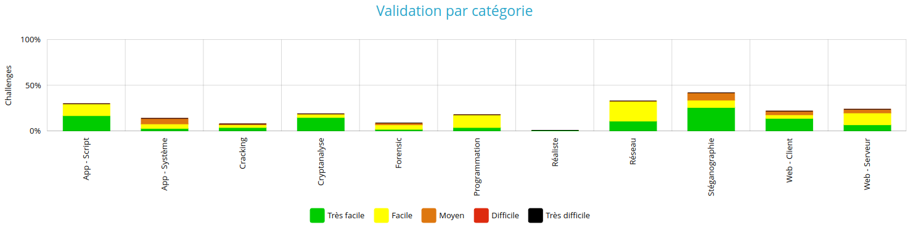
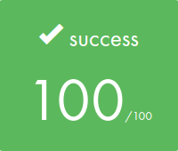

# Hi there, welcome to my official public repo 👋

For 20 years, I wore the badge of a police officer 👮‍♂️, dedicating myself to ensuring safety and upholding the law. My passion for security was not just limited to the physical realm; it extended to the digital world as well.

**In November 2022**, I embarked on a transformative journey by enrolling at **42 School**. This institution opened the doors to the vast and intricate world of coding for me. Since my first day at 42 🎓, I've immersed myself in a multitude of projects, each one broadening my horizons. These projects, spanning various programming languages, have allowed me to delve into diverse themes, with a particular interest in security and cybersecurity.

42 School has been more than just an educational institution for me. It's a place where I've met some of the most genuine, brilliant minds. Collaborating with these individuals, coupled with the guidance from the exceptional pedagogical team, has pushed me to surpass my limits day after day.

Whether it's assignments from 42 or my personal ventures, each project represents a milestone in my coding journey. I invite you to explore my repositories to witness the array of challenges I've embraced and the innovative solutions I've devised. My passion for security, both in the real and digital worlds, continues to drive my endeavors in the realm of coding and cybersecurity.

----

## Summary

🚀 Dive into my repositories below to explore a diverse array of projects **I've passionately crafted**, ranging from 42 School assignments to personal endeavors that showcase my evolving journey in the world of coding.

----

### C projects

[Libft](https://github.com/jmbertin/Libft) - 42 school curriculum. Very first project in 42. It's a C library that recreates certain standard functions from the libc, as well as a few additional and bonus functions that prove to be extremely useful for subsequent projects.

[Ft_printf](https://github.com/jmbertin/FT_Printf) - 42 school curriculum. It's an attempt to recreate the famous printf function found in the C standard library, a function known for its versatility in handling string formatting. This version is a simplified take on it.

[Ft_nm](https://github.com/jmbertin/Ft_Nm) - 42 school curriculum. It's a custom implementation of the UNIX nm command, designed to display the symbol table of ELF binaries. This project was developed as part of a UNIX programming assignment and replicates the core functionality of the GNU nm command (GNU Binutils for Ubuntu) v2.40.

[Minitalk](https://github.com/jmbertin/Minitalk) - 42 school curriculum. It's a unique communication system built on UNIX signals. This lightweight server-client application allows for a simple and direct means of interprocess communication through customized handling of SIGUSR1 and SIGUSR2 signals.

----

### Security projects

[Rainfall](https://github.com/jmbertin/Rainfall) - 42 school curriculum. This project is part of the intermediate security course. Rainfall is a Capture The Flag (CTF) challenge where you will find vulnerabilities in code and exploit them to progress to the next level.

[Dr_Quine](https://github.com/jmbertin/Dr_Quine) - 42 school curriculum. This project invites you to confront the principle of self-reproduction and the problems that derive from it. It is a perfect introduction to more complex projects, particularly malware projects.

[Override](https://github.com/jmbertin/Override) - 42 school curriculum. This project is the last security course. Override is a Capture The Flag (CTF) challenge where you will find vulnerabilities in code and exploit them to progress to the next level.

----

### C++ projects

[Ft_IRC](https://github.com/jmbertin/Ft_IRC) - 42 school curriculum. It's about creating our own IRC server according to standard RFC 2813 in C++ language.

----

### SysAdmin projects

[Docker - Inception](https://github.com/jmbertin/Inception) - 42 school curriculum. This project allows you to discover and become familiar with Docker and its tools, building a functionnal local Wordpress website.

[Kubernetes - Inception_of_things](https://github.com/jmbertin/Inception_of_things) - 42 school curriculum. A minimal introduction to Kubernetes. It's a deep dive into system administration, leveraging technologies such as K3S, K3D, Vagrant, and Argo CD to set up a virtual environment and deploy web applications.

----

### Other projects

[React Native - Snake Game](https://github.com/jmbertin/ReactNative-Snake) - This is my first React Native project. A classical Snake game, developed using React Native! This game is compatible with both iOS and Android platforms. 

----

### Python projects

[N-Puzzle](https://github.com/jmbertin/N-Puzzle) - 42 school curriculum. This is a Python script for solving the N-Puzzle problem using the A* search or greedy algorithms.

----

## Root-me statistics

[Root-Me Profil Page Link](https://www.root-me.org/jbertin?inc=info&lang=fr)

----

## HackTheBox statistics

[HackTheBox Profil Page Link](https://app.hackthebox.com/profile/1314046)

<!--

### C++ projects

**jmbertin/jmbertin** is a ✨ _special_ ✨ repository because its `README.md` (this file) appears on your GitHub profile.

Here are some ideas to get you started:

- 🔭 I’m currently working on ...
- 🌱 I’m currently learning ...
- 👯 I’m looking to collaborate on ...
- 🤔 I’m looking for help with ...
- 💬 Ask me about ...
- 📫 How to reach me: ...
- 😄 Pronouns: ...
- ⚡ Fun fact: ...
-->
