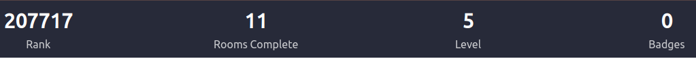

<h1 align="center"><b>Hi there, welcome to my official public repo 👋</b></h1>
 

For 20 years, I wore the badge of a police officer 👮‍♂️, dedicating myself to ensuring safety and upholding the law. My passion for security was not just limited to the physical realm; it extended to the digital world as well.

**In November 2022**, I embarked on a transformative journey by enrolling at **42 School**. This institution opened the doors to the vast and intricate world of coding for me. Since my first day at 42 🎓, I've immersed myself in a multitude of projects, each one broadening my horizons. These projects, spanning various programming languages, have allowed me to delve into diverse themes, with a particular interest in security and cybersecurity.

42 School has been more than just an educational institution for me. It's a place where I've met some of the most genuine, brilliant minds. Collaborating with these individuals, coupled with the guidance from the exceptional pedagogical team, has pushed me to surpass my limits day after day.

Whether it's assignments from 42 or my personal ventures, each project represents a milestone in my coding journey. I invite you to explore my repositories to witness the array of challenges I've embraced and the innovative solutions I've devised. My passion for security, both in the real and digital worlds, continues to drive my endeavors in the realm of coding and cybersecurity.

----

## Summary

🚀 Dive into my repositories below to explore a diverse array of projects **I've passionately crafted**, ranging from 42 School assignments to personal endeavors that showcase my evolving journey in the world of coding.
**Just click on a category to expand and view all related projects!**

C projects

  
 

[Libft](https://github.com/jmbertin/Libft) - 42 school curriculum. Very first project in 42. It's a C library that recreates certain standard functions from the libc, as well as a few additional and bonus functions that prove to be extremely useful for subsequent projects.

[Ft_printf](https://github.com/jmbertin/FT_Printf) - 42 school curriculum. It's an attempt to recreate the famous printf function found in the C standard library, a function known for its versatility in handling string formatting. This version is a simplified take on it.

[Ft_nm](https://github.com/jmbertin/Ft_Nm) - 42 school curriculum. It's a custom implementation of the UNIX nm command, designed to display the symbol table of ELF binaries. This project was developed as part of a UNIX programming assignment and replicates the core functionality of the GNU nm command (GNU Binutils for Ubuntu) v2.40.

[Minitalk](https://github.com/jmbertin/Minitalk) - 42 school curriculum. It's a unique communication system built on UNIX signals. This lightweight server-client application allows for a simple and direct means of interprocess communication through customized handling of SIGUSR1 and SIGUSR2 signals.

[Malloc](https://github.com/jmbertin/Malloc) - 42 school curriculum. In this project, we have implemented our own versions of the `malloc`, `free`, and `realloc` functions to dynamically manage memory in C programs.

[Lem-IPC](https://github.com/jmbertin/Lem-IPC) - 42 school curriculum. Lem-IPC is an automated game where bots, grouped into teams, strategically position themselves on a 2D board. The primary objective is for a team to outlast the others and claim the board. Bots are eliminated when surrounded by members of another team. The game's climax is reached when only one team remains on the battlefield.

[Ft_ping](https://github.com/jmbertin/Ft_ping) - 42 school curriculum. This repository contains a custom implementation of the ping utility, written in C. The program sends ICMP ECHO_REQUEST packets to network hosts and displays the response to measure the round-trip time and packet loss.

[Ft_ssl_md5](https://github.com/jmbertin/Ft_ssl_md5) - 42 school curriculum. This program provides an implementation of popular cryptographic hashing algorithms, including MD5, SHA256 and Whirlpool. It allows users to generate hash digests of strings, files, or standard input.

 

Security projects

  
 

[Rainfall](https://github.com/jmbertin/Rainfall) - 42 school curriculum. This project is part of the intermediate security course. Rainfall is a Capture The Flag (CTF) challenge where you will find vulnerabilities in code and exploit them to progress to the next level.

[Dr_Quine](https://github.com/jmbertin/Dr_Quine) - 42 school curriculum. This project invites you to confront the principle of self-reproduction and the problems that derive from it. It is a perfect introduction to more complex projects, particularly malware projects.

[Override](https://github.com/jmbertin/Override) - 42 school curriculum. This project is the last security course. Override is a Capture The Flag (CTF) challenge where you will find vulnerabilities in code and exploit them to progress to the next level.

[Boot2Root](https://github.com/jmbertin/Boot2Root) - 42 school curriculum. This project is a security course at 42 School. Boot2Root is some sort of a Capture The Flag (CTF) challenge where you will find vulnerabilities in code and exploit them to progress to your utlimate goal : become root.

[Darkly](https://github.com/jmbertin/Darkly) - 42 school curriculum. This project is the first in the cybersecurity branch of the curriculum at school 42. In this project you must succeed in locating and exploiting various common security vulnerabilities on a website.

[Snow Crash](https://github.com/jmbertin/Snow_crash) - 42 school curriculum. Snow crash is a Capture The Flag (CTF) challenge where you will find vulnerabilities in code and exploit them to progress to the next level.

[Spider](https://github.com/jmbertin/Spider) - 42 school curriculum (Cybersecurity Piscine). A python web-images scrapper.

[Scorpion](https://github.com/jmbertin/Scorpion) - 42 school curriculum (Cybersecurity Piscine). A python metadata retriever.

[OTP](https://github.com/jmbertin/OTP) - 42 school curriculum (Cybersecurity Piscine). A python utility to securely store an initial password (in hexadecimal format) and generate one-time passwords based on the HOTP algorithm.

[Onion](https://github.com/jmbertin/Onion) - 42 school curriculum (Cybersecurity Piscine). A docker a web service that is accessible via the Tor network.

[Reverse_me](https://github.com/jmbertin/Reverse_me) - 42 school curriculum (Cybersecurity Piscine). This repository contains a set of three challenges, each one being a unique password-checking program. Objective is to both deduce the correct password for each level and also understand how to patch the program to bypass the password verification.

[Stockholm](https://github.com/jmbertin/Stockholm) - 42 school curriculum (Cybersecurity Piscine). A python utility designed to encrypt or decrypt files within a specified directory. The goal is to reproduce the behavior of Ransomware-type malware.

[Inquisitor](https://github.com/jmbertin/Inquisitor) - 42 school curriculum (Cybersecurity Piscine). A python utility tool designed to perform ARP poisoning on a network and eavesdrop on FTP traffic (and others).

 
 

C++ projects

  
 

[Ft_IRC](https://github.com/jmbertin/Ft_IRC) - 42 school curriculum. It's about creating our own IRC server according to standard RFC 2813 in C++ language.
  
 

SysAdmin projects

  
 

[Docker - Inception](https://github.com/jmbertin/Inception) - 42 school curriculum. This project allows you to discover and become familiar with Docker and its tools, building a functionnal local Wordpress website.

[Kubernetes - Inception_of_things](https://github.com/jmbertin/Inception_of_things) - 42 school curriculum. A minimal introduction to Kubernetes. It's a deep dive into system administration, leveraging technologies such as K3S, K3D, Vagrant, and Argo CD to set up a virtual environment and deploy web applications.

[Cloud 1](https://github.com/jmbertin/Cloud_1) - 42 school curriculum. A minimal introduction to cloud management. This project aims to deploy WordPress sites simultaneously on several servers, in the cloud, using Ansible.

 

React native projects

  
 

[Snake Game](https://github.com/jmbertin/ReactNative-Snake) - This is my first React Native project. A classical Snake game, developed using React Native! This game is compatible with both iOS and Android platforms. 

[FT_Hangouts](https://github.com/jmbertin/ReactNative-Snake) - 42 school curriculum. A reproduction of the basic functionality of the Hangouts application. Developed using React Native!

[42SchoolProjects](https://github.com/jmbertin/42SchoolProjects) - Personnal project. A project to help students of 42 to manage their projects and acces to projects informations.

[Swifty_Companion](https://github.com/jmbertin/Swifty_Companion) - 42 school curriculum. This project aims to create an application capable of connecting to API 42 and displaying certain information concerning students.

 

Python projects

  
 

[N-Puzzle](https://github.com/jmbertin/N-Puzzle) - 42 school curriculum. This is a Python script for solving the N-Puzzle problem using the A* search or greedy algorithms.

[Linear_regression](https://github.com/jmbertin/Linear_regression) - 42 school curriculum. The aim of this project is to introduce to the basic concept behind machine learning by creating a linear regression algorithm, with gradient descent.

[DSLR](https://github.com/jmbertin/Dslr) - 42 school curriculum. A logistic regression project on the theme of Harry Potter by recoding the Sorting Hat.

 

 

----
<h1 align="center"><b>Statistics</b></h1>

## Github
   

----

## Root-me statistics

[Root-Me Profil Page Link](https://www.root-me.org/jbertin?inc=info&lang=fr)

----

## HackTheBox statistics

[HackTheBox Profil Page Link](https://app.hackthebox.com/profile/1314046)

----

## TryHackMe statistics

[TryHackMe Profil Page Link](https://tryhackme.com/p/jmbcorp999)

----

<!--

### C++ projects

**jmbertin/jmbertin** is a ✨ _special_ ✨ repository because its `README.md` (this file) appears on your GitHub profile.

Here are some ideas to get you started:

- 🔭 I’m currently working on ...
- 🌱 I’m currently learning ...
- 👯 I’m looking to collaborate on ...
- 🤔 I’m looking for help with ...
- 💬 Ask me about ...
- 📫 How to reach me: ...
- 😄 Pronouns: ...
- ⚡ Fun fact: ...
-->
